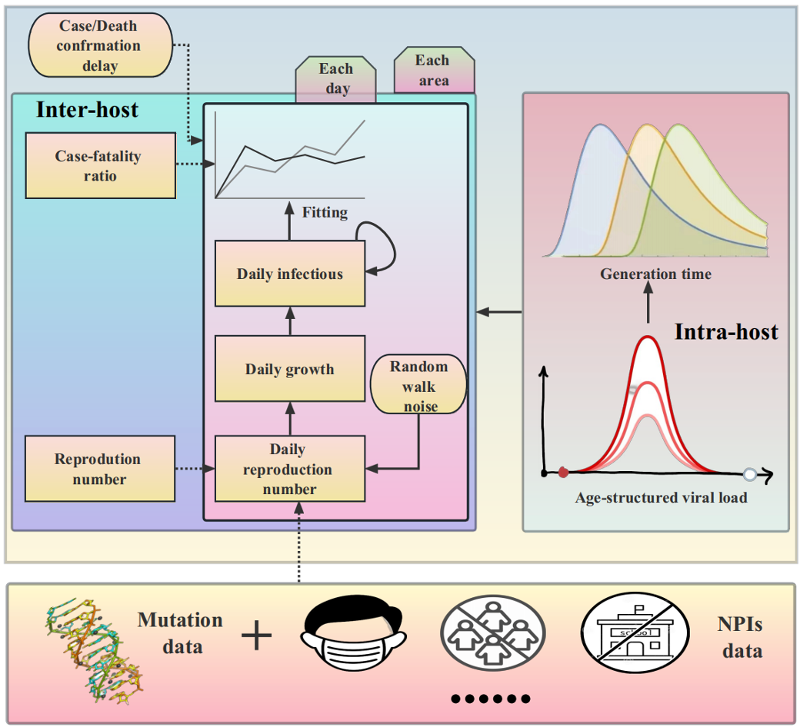
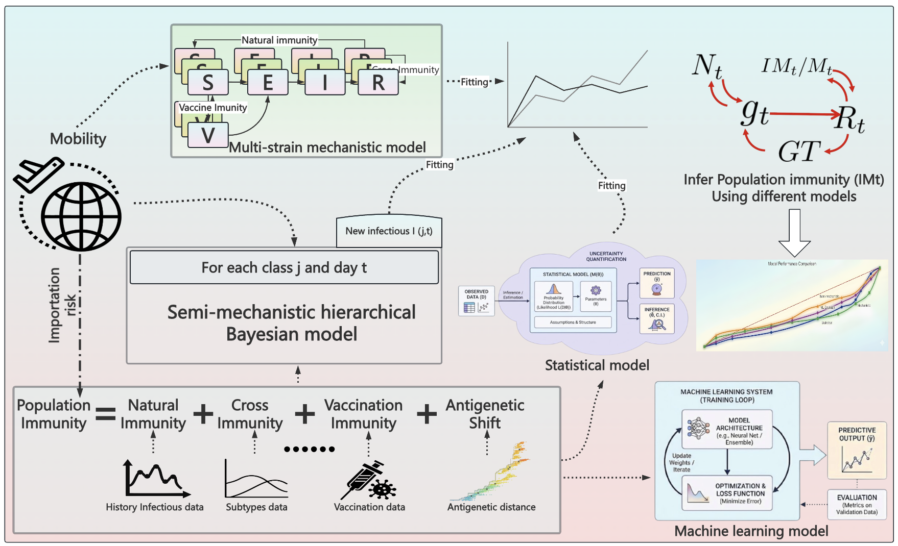
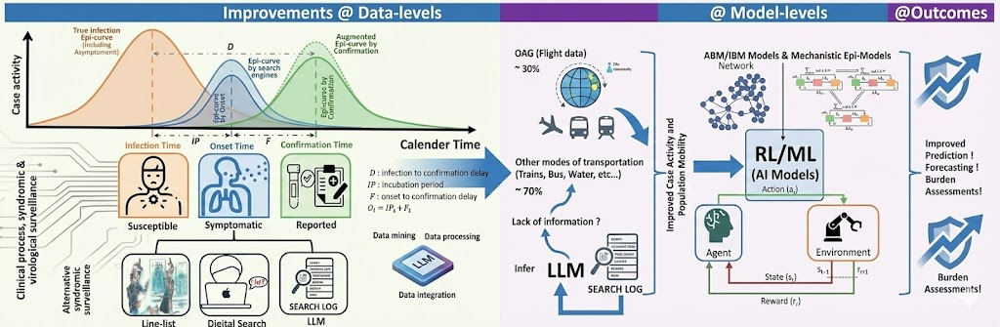

Hi! I’m Jackie, currently a first-year PhD student at The University of Hong Kong, working with Prof. [Ben Cowling](https://sph.hku.hk/en/Biography/Cowling-Benjamin-John) and Prof. [Sheikh Taslim Ali](https://sph.hku.hk/en/Biography/Ali-Sheikh-Taslim). 
I obtained my M.Sc. in Systems Science in 2024 and my B.Eng. in Information Systems and Technology in 2021. 

My research interests lie in **Infectious disease modeling (IDM)** and  **AI for health (AI4health)**.

Develop new multiscale modeling methods to characterize cross-scale infectious disease dynamics
======
  

**Develop a new Bayesian machine learning framework to examine the impact of macroscopic policies on microscopic
pathogen dynamics, and to identify generation time as a key mechanistic link bridging micro-level viral load dynamics and macro-level epidemic growth rates.**

 Unravel how population immunity and viral co-circulation influence each other to predict future pandemics and viral evolution
======

**Integrating multi-source surveillance and behavioural data to reveal the bidirectional interplay between population immunity and viral co-circulation.**

AI-Based Framework for Early Detection and Intervention in Multiple Respiratory Disease Epidemics
======

**Illustration of the predictive frameworks with data-driven hypotheses, methodological and implicative 
improvement for early prediction of epidemics, severity, burden for multiple respiratory viruses using an integrated interface 
of AI-Model and epidemic models for real-time interventions.**

